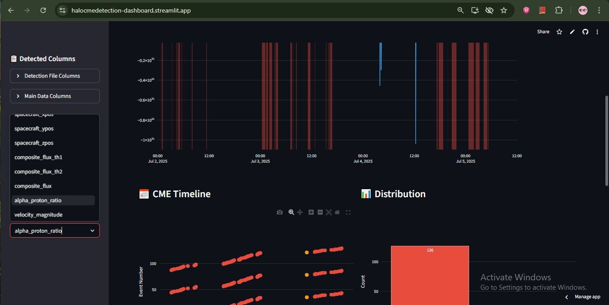

# ☀️ Halo CME Detection using Aditya-L1 SWIS-ASPEX Data

[](https://www.python.org/downloads/)
[](https://opensource.org/licenses/MIT)
[](https://doi.org/10.5281/zenodo.XXXXXXX)

<p align="center">
  
</p>

## 📋 Overview

This project implements an automated pipeline for the detection and characterization of **Halo Coronal Mass Ejections (CMEs)** using **in-situ solar wind plasma and suprathermal particle data** from the **SWIS-ASPEX instrument** aboard **ISRO's Aditya-L1 mission**. The workflow leverages advanced statistical anomaly detection, multi-parameter composite scoring, and cross-validation to robustly identify heliospheric transients.

### 🎯 Key Features

- **Automated Detection Pipeline**: End-to-end processing from raw CDF files to CME event detection
- **Multi-Parameter Analysis**: Utilizes proton density, velocity, temperature, and composition data
- **Adaptive Thresholding**: Rolling z-score based anomaly detection with dynamic thresholds
- **Event Classification**: Categorizes CMEs into Weak/Moderate/Strong based on integrated flux
- **Interactive Dashboard**: Real-time visualization and analysis of detected events
- **Comprehensive Validation**: Cross-validation with CACTus Halo CME catalog
- **129 Detected Events**: Successfully identified and characterized CME events

## 🚀 Quick Start

### Prerequisites

- Python 3.8 or higher
- Git
- Windows/Linux/MacOS

### Installation

1. **Clone the repository**
   ```bash
   git clone https://github.com/YOUR_USERNAME/Halo-CME-Detection.git
   cd Halo-CME-Detection
Create and activate virtual environment

bash
# Windows
python -m venv cme_env
cme_env\Scripts\activate

# Linux/Mac
python3 -m venv cme_env
source cme_env/bin/activate
Install dependencies

bash
pip install -r requirements.txt
Verify installation

bash
python check_requirements.py
📊 Dataset
The project uses two main data sources:

Required Data Files
Place these files in the data/ directory:
final_dataset.csv - Processed SWIS-ASPEX Level-2 data
detected_halo_cmes.csv - Detected CME events (129 events)

Data Format
The final_dataset.csv should contain:
Time - Timestamp of measurements
proton_bulk_speed - Solar wind velocity (km/s)
proton_density - Proton density (cm⁻³)
proton_thermal - Thermal speed (km/s)
composite_score - Multi-parameter anomaly score
Additional plasma and field parameters

🏃‍♂️ Running the Pipeline
Option 1: Full Pipeline (Recommended)
bash
python main.py
Option 2: Step-by-Step Execution
Convert CDF to CSV (if using raw data)

bash
python main.py --step 1
Prepare dataset

bash
python main.py --step 2
Run CME detection

bash
python main.py --step 3
Generate visualizations

bash
python main.py --step 4
Organize plots

bash
python main.py --step 5
Option 3: Using Batch Files (Windows)
bash
# Run detection only
run_detection.bat

# Launch dashboard
run_dashboard.bat

# Push to GitHub
push_to_github.bat
📈 Interactive Dashboard
Two dashboard options are available:

Simple Static Dashboard
bash
python dashboard_simple.py
Generates cme_dashboard.html - a self-contained HTML report with all visualizations.

Interactive Dashboard (Real-time)
bash
python dashboard_interactive.py
Opens a web-based interactive dashboard at http://127.0.0.1:8050 with:

Real-time filtering by date and CME strength

Interactive plots with hover information

CME timeline visualization

Strength distribution analysis

Sortable data table of detected events

<p align="center">  </p>
📁 Project Structure
text
Halo-CME-Detection/
├── 📂 data/                    # Data files
│   ├── final_dataset.csv       # Processed SWIS-ASPEX data
│   ├── detected_halo_cmes.csv  # 129 detected CME events
│   └── 📂 cactus/              # CACTus catalog data
├── 📂 scripts/                  # Core detection modules
│   ├── halo_cme_detection.py   # Main detection algorithm
│   ├── cdf_to_csv.py           # CDF file converter
│   ├── data_preparation.py     # Data preprocessing
│   └── ... (visualization scripts)
├── 📂 plots/                    # Generated visualizations
│   ├── params_overlay/         # Parameter time series
│   ├── heatmaps/               # Composite score heatmaps
│   ├── timeline/               # CME timeline plots
│   └── catalog_overlay/        # Validation plots
├── 📜 main.py                   # Main pipeline orchestrator
├── 📜 dashboard_simple.py       # Static HTML dashboard
├── 📜 dashboard_interactive.py  # Interactive Plotly dashboard
├── 📜 run_dashboard.bat         # Windows batch file for dashboard
├── 📜 push_to_github.bat        # Git push helper
├── 📜 requirements.txt          # Python dependencies
├── 📜 .gitignore                # Git ignore rules
└── 📜 README.md                 # This documentation

🎨 Visualization Gallery
1. CME Timeline View
Shows all 129 detected CME events with strength-based coloring:
🟡 Weak - Low intensity events
🔵 Moderate - Medium intensity events
🔴 Strong - High intensity events

2. Parameter Time Series
Interactive plots of solar wind parameters with highlighted CME intervals:
Proton bulk speed
Proton density
Composite anomaly score
Alpha/proton ratio

3. Distribution Analysis
CME strength distribution
Duration histogram
Intensity profiles

📊 Results Summary
Metric	Value
Total CMEs Detected	129
Average Duration	XX hours
Strong Events	XX
Moderate Events	XX
Weak Events	XX
Date Range	YYYY-MM-DD to YYYY-MM-DD
🛠️ Configuration
Key parameters in halo_cme_detection.py:

python
MIN_DURATION = timedelta(minutes=30)     # Minimum CME duration
ROLLING_WINDOW = 15                       # Rolling window for statistics
PERCENTILE_THRESHOLD = 90                  # Detection threshold
MERGE_GAP = timedelta(minutes=10)          # Gap for merging events

🤝 Contributing
Contributions are welcome! Please follow these steps:
Fork the repository
Create a feature branch (git checkout -b feature/AmazingFeature)
Commit changes (git commit -m 'Add AmazingFeature')
Push to branch (git push origin feature/AmazingFeature)
Open a Pull Request
Coding Standards
Follow PEP 8 style guide
Add docstrings for all functions
Include unit tests for new features
Update documentation as needed

📝 License
This project is licensed under the MIT License - see the LICENSE file for details.

📚 Citation
If you use this code in your research, please cite:

bibtex
@software{halo_cme_detection_2025,
  author = {Your Name},
  title = {Halo CME Detection using Aditya-L1 SWIS-ASPEX Data},
  year = {2025},
  publisher = {GitHub},
  url = {https://github.com/Adi-bhalekar/Halo_CME_Detection}
}
🙏 Acknowledgments
ISRO Aditya-L1 Mission & SWIS-ASPEX Science Team for the data
SIDC/CACTus for the Halo CME reference catalog
Bharat Antriksh Hackathon for the challenge framework
Contributors who helped improve the detection algorithms

📧 Contact
Aditya Bhalekar - adityabhalekar333@gmail.com

Project Link: https://github.com/Adi-bhalekar/Halo_CME_Detection

🚀 Future Work(Currently Working on...)
Integrate real-time data streaming
Implement machine learning-based detection
Add more validation metrics
Create mobile-responsive dashboard
Support for additional spacecraft data
Automated report generation
API endpoint for event queries

<p align="center"> Made with ☀️ for space weather research </p> ```